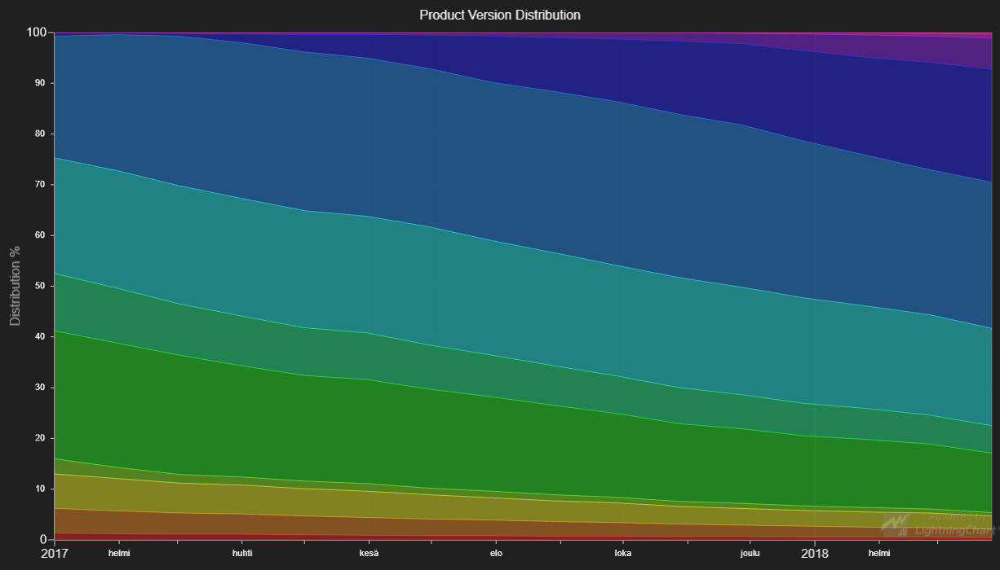

# JavaScript Stacked Mountains Chart



This demo application belongs to the set of examples for LightningChart JS, data visualization library for JavaScript.

LightningChart JS is entirely GPU accelerated and performance optimized charting library for presenting massive amounts of data. It offers an easy way of creating sophisticated and interactive charts and adding them to your website or web application.

The demo can be used as an example or a seed project. Local execution requires the following steps:

- Make sure that relevant version of [Node.js](https://nodejs.org/en/download/) is installed
- Open the project folder in a terminal:

        npm install              # fetches dependencies
        npm start                # builds an application and starts the development server

- The application is available at *http://localhost:8080* in your browser, webpack-dev-server provides hot reload functionality.


## Description

*Also known as Stacked Area Graph or Stacked Areas*

The stacked charts are a popular visual aid used for categorizing and comparing the parts of a whole using different colors to distinguish the categories.

This chart is created with custom stacking logic by using ***Area*** and ***AreaRange*** series and position each next data segment on top of the previous. Relying on characteristics and use cases of mountain series mentioned in previous examples, area is drawn on a Cartesian coordinate system and represents the quantitative data. Thus, in the example, the first data segment starts from a zero baseline and each next category would use the magnitude of previous segment as a low starting point.

```javascript
// Create one Area series to be the base.
const areaFirst = chart.addAreaSeries()

// Create the next AreaRange series to be stacked on top of previous.
const areaNext1 = chart.addAreaRangeSeries()
const areaNext2 = chart.addAreaRangeSeries()
```


## API Links

* [XY cartesian chart]
* [Area point]
* [Area series]
* [Area type]
* [Positive Area series]
* [Negative Area series]
* [Area Range series]
* [Color palettes]
* [Solid FillStyle]
* [RGBA color factory]


## Support

If you notice an error in the example code, please open an issue on [GitHub][0] repository of the entire example.

Official [API documentation][1] can be found on [Arction][2] website.

If the docs and other materials do not solve your problem as well as implementation help is needed, ask on [StackOverflow][3] (tagged lightningchart).

If you think you found a bug in the LightningChart JavaScript library, please contact support@arction.com.

Direct developer email support can be purchased through a [Support Plan][4] or by contacting sales@arction.com.

[0]: https://github.com/Arction/
[1]: https://www.arction.com/lightningchart-js-api-documentation/
[2]: https://www.arction.com
[3]: https://stackoverflow.com/questions/tagged/lightningchart
[4]: https://www.arction.com/support-services/

© Arction Ltd 2009-2020. All rights reserved.


[XY cartesian chart]: https://www.arction.com/lightningchart-js-api-documentation/v3.1.0/classes/chartxy.html
[Area point]: https://www.arction.com/lightningchart-js-api-documentation/v3.1.0/interfaces/areapoint.html
[Area series]: https://www.arction.com/lightningchart-js-api-documentation/v3.1.0/classes/chartxy.html#addareaseries
[Area type]: https://www.arction.com/lightningchart-js-api-documentation/v3.1.0/globals.html#areaseriestypes
[Positive Area series]: https://www.arction.com/lightningchart-js-api-documentation/v3.1.0/classes/areaseriespositive.html
[Negative Area series]: https://www.arction.com/lightningchart-js-api-documentation/v3.1.0/classes/areaseriesnegative.html
[Area Range series]: https://www.arction.com/lightningchart-js-api-documentation/v3.1.0/classes/arearangeseries.html
[Color palettes]: https://www.arction.com/lightningchart-js-api-documentation/v3.1.0/globals.html#colorpalettes
[Solid FillStyle]: https://www.arction.com/lightningchart-js-api-documentation/v3.1.0/classes/solidfill.html
[RGBA color factory]: https://www.arction.com/lightningchart-js-api-documentation/v3.1.0/globals.html#colorrgba

